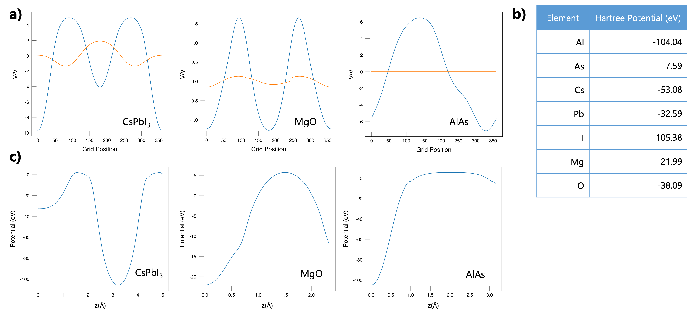

# Summary

We report a Python package to simplify the analysis of electrostatic potentials and electron density of crystals. Macrodensity can read volumetric output files from the first-principles materials modelling codes VASP (LOCPOT format) and FHI-AIMS (cube format), as well as the classical electrostatic potentials from GULP (standard output). The code consists of... planar...

# Statement of need

When assessing the novel semiconducting materials and devices (p-n junctions, 
heterostructures, surface terminations) through simulation, an understanding of the 
variation in the electrostatic potential and electron density across the system is key [@Politzer:2002]. However, extraction and useful presentation of this data from the raw output of the simulation can prove cumbersome and often require the use of visualisation software followed 
by manual data extraction. This can result in bottlenecks in high throughput screening projects, 
where the same data extraction procedure is repeatedly applied to large databases of candidate structures.

The general approach of electrostatic potential and electron density data as well as its translation to a grid mesh has been discussed in @Bulter:2014. This approach uses the Kohn-Sham density functional theory framework. This approach then samples the spherical averages over points within the system onto a matrix, where our raw data is generated. To process this data appropriately, ``MacroDensity`` was developed to simplify the data extraction and visualisation processes.  By defining planes or vectors along the landscape of electrostatic potentials and electronic density matrix, it becomes straightforward to produce meaningful analysis and plots for visualisation across a user-defined area. 

# MacroDensity

``MacroDensity`` is a set of Python modules developed to read and analyse electrostatic potentials and electron density data from electronic structure calculations derived from Density Functional Theory (DFT) [@Kohn:1996]. The package allows users to read from VASP LOCPOT [@vasp], CHGCAR files, FHI-AIMS [@fhi_aims], *.cube file, and GULP *.out files and format the data into physically meaningful quantities, which can then be plotted for user interpretation.

\begin{equation}
\label{eq:planar-average}
  \rho = ......
\end{equation}

The package formats datasets containing information about a system's lattice parameters electron density, and electrostatic potentials. ``MacroDensity`` contains some high-level tools and functions to calculate and plot the planar and macroscopic average (as defined in Jackson's Electrodynamics [@Jackson:2003]). The determination of the lattice vector settings and how the macroscopic averaging is calculated in this package is best described from the work of
@Peressi:1998. 

``MacroDensity`` can also calculate and plot the localised potential around a certain atomic nucleus of a system. The approach to calculating this on-site (Hartree) potential is similar to calculating the Madelung potential. this is useful for electron energy level predictions [@Walsh:2013]. In addition, the spherical average around a user-defined point within the system can be calculated using the package. Calculations and averaging of this average at different points in space can be used to quantify the valence band and conduction band positions relative to this average. This is a convenience function that is included within the package, which calculates the bulk interstitial alignment similarly to that from @Frensley:1976. 

``MacroDensity`` also contains other functions including the Moving Average, which calculates the average and macroscopic potentials within a specified volume of cube which moves along a plane of the system's lattice. The approach to this calculation is similar to the spherical average 
function.

``MacroDensity`` has been used to rapidly generate data for the publications @Bulter:2014 and @Walsh:2013 amongst others. 

# Citations

Citations to entries in paper.bib should be in
[rMarkdown](http://rmarkdown.rstudio.com/authoring_bibliographies_and_citations.html)
format.

If you want to cite a software repository URL (e.g. something on GitHub without a preferred
citation) then you can do it with the example BibTeX entry below for @fidgit.

For a quick reference, the following citation commands can be used:
- `@author:2001`  ->  "Author et al. (2001)"
- `[@author:2001]` -> "(Author et al., 2001)"
- `[@author1:2001; @author2:2001]` -> "(Author1 et al., 2001; Author2 et al., 2002)"

# Figures

Figures can be included like this:

and referenced from text using \autoref{fig:example}.

Figure sizes can be customized by adding an optional second parameter:
{ width=20% }

# Acknowledgements

We acknowledge input from Adam J. Jackson and Jarvist M. Frost in the early stages of the project. The work received financial support by Samsung Advanced Institute of Technology.     