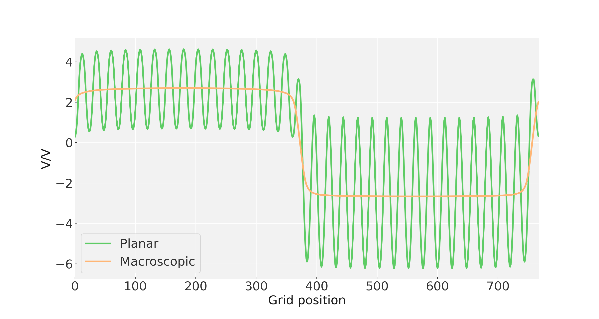

.. _tutorials:

Tutorials
=========

Planar averaging of a potential
-------------------------------

This example is for plotting the planar average of a potential along a vector (here it is z). The only variables which need to be set are in the first three lines. 
Note ``LOCPOT`` file is just a regular ``VASP`` grid file. You can find a ``Jupyter`` notebook of this tutorian in the main repository under 
``tutorials/Slab/SlabCalculation.ipynb``

Here ``lattice_vector`` is the length of a repeat unit in the direction
of the averaging, it is used to calculate the macroscopic average.

.. code:: python

    import macrodensity as md
    import math
    import numpy as np
    import matplotlib.pyplot as plt

    input_file = 'LOCPOT'
    lattice_vector = 4.75
    planar_file = 'planar.dat'
    macroscopic_file = 'planar.dat'

Nex we read in the potential and convert it to a grid.

.. code:: python

    vasp_pot, NGX, NGY, NGZ, Lattice = md.read_vasp_density(input_file)
    vector_a, vector_b, vector_c, av, bv, cv = md.matrix_2_abc(Lattice)
    resolution_x = vector_a/NGX
    resolution_y = vector_b/NGY
    resolution_z = vector_c/NGZ
    grid_pot, electrons = md.density_2_grid(vasp_pot,NGX,NGY,NGZ)

Finally we get planar and macroscopic averages and save and plot these.

.. code:: python

    planar = md.planar_average(grid_pot, NGX, NGY, NGZ)
    macro  = md.macroscopic_average(planar,lattice_vector,resolution_z)
    plt.plot(planar)
    plt.plot(macro)
    plt.savefig('Planar.eps')
    plt.show()
    np.savetxt(planar_file, planar)
    np.savetxt(macroscopic_file, macro)

Heterojunction offset
---------------------

This example gets the potential offset at a heterojunction interface. You can find a ``Jupyter`` notebook of this tutorian in the main repository under
``tutorials/HeteroJunction/HeteroJunction.ipynb``. Note that this tutorial uses the ``LOCPOT`` in the ``HeteroJunction`` directory of ``tutorials``.

.. image:: images/hj.png
  :width: 700
  :alt: Alternative text

Here ``lattice_vector`` is the length of a repeat unit in the direction
of the averaging, it is used to calculate the macroscopic average.

.. code:: python

    import os
    import macrodensity as md
    import math
    import numpy as np
    import matplotlib.pyplot as plt
    import matplotlib as mpl

    input_file = 'LOCPOT'
    lattice_vector = 3.6
    output_file = 'planar.dat'

    vasp_pot, NGX, NGY, NGZ, Lattice = md.read_vasp_density(input_file)
    vector_a,vector_b,vector_c,av,bv,cv = md.matrix_2_abc(Lattice)
    resolution_x = vector_a/NGX
    resolution_y = vector_b/NGY
    resolution_z = vector_c/NGZ
    grid_pot, electrons = md.density_2_grid(vasp_pot,NGX,NGY,NGZ)

    ## POTENTIAL
    planar = md.planar_average(grid_pot, NGX, NGY, NGZ)
    ## MACROSCOPIC AVERAGE
    macro  = md.macroscopic_average(planar, lattice_vector/2, resolution_z)

We can now plot the results:

.. code:: python

    fig, ax1 = plt.subplots(1, 1, sharex=True)

    textsize = 22
    mpl.rcParams['xtick.labelsize'] = textsize
    mpl.rcParams['ytick.labelsize'] = textsize
    mpl.rcParams['figure.figsize'] = (15, 8)

    ax1.plot(planar,label="Planar",lw=3)
    ax1.plot(macro,label="Macroscopic",lw=3)

    ax1.set_ylabel('V/V', fontsize=22)
    ax1.set_xlabel('Grid position', fontsize=22)
    
    ax1.set_xlim(0,len(planar))

    ax1.set_facecolor((0.95,0.95,0.95))
    ax1.grid(True)

    ax1.legend(fontsize=22)
    plt.show()

